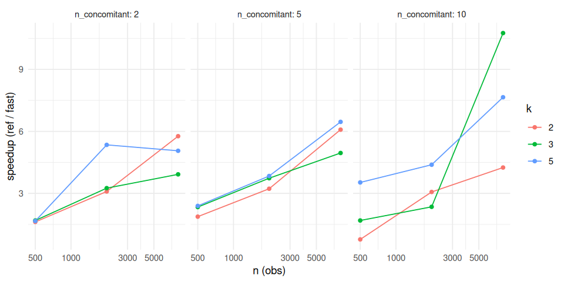

# FastFLXPmultinom benchmark

*Generated: 2026-05-30 13:10:27 UTC*

R 4.6.0; flexmix 2.3.20; flexmix.extensions 0.0.0.9000.

Times are medians over 3 iterations. `speedup = ref / fast`.

## Results

|    n |   k | n_concomitant |   ref_s | fast_s | speedup |
|-----:|----:|--------------:|--------:|-------:|--------:|
|  500 |   2 |             2 |  0.0788 | 0.0487 |   1.620 |
|  500 |   2 |             5 |  0.3690 | 0.1970 |   1.880 |
|  500 |   2 |            10 |  0.3170 | 0.4100 |   0.774 |
|  500 |   3 |             2 |  0.4290 | 0.2540 |   1.690 |
|  500 |   3 |             5 |  1.1700 | 0.4990 |   2.340 |
|  500 |   3 |            10 |  0.9710 | 0.5750 |   1.690 |
|  500 |   5 |             2 |  1.0500 | 0.6310 |   1.660 |
|  500 |   5 |             5 |  1.5200 | 0.6330 |   2.390 |
|  500 |   5 |            10 |  3.5700 | 1.0100 |   3.530 |
| 2000 |   2 |             2 |  0.1960 | 0.0634 |   3.090 |
| 2000 |   2 |             5 |  0.4680 | 0.1450 |   3.230 |
| 2000 |   2 |            10 |  0.7700 | 0.2510 |   3.070 |
| 2000 |   3 |             2 |  1.3600 | 0.4180 |   3.250 |
| 2000 |   3 |             5 |  2.4100 | 0.6460 |   3.730 |
| 2000 |   3 |            10 |  4.1900 | 1.7800 |   2.350 |
| 2000 |   5 |             2 |  4.9400 | 0.9230 |   5.350 |
| 2000 |   5 |             5 |  5.3300 | 1.3900 |   3.840 |
| 2000 |   5 |            10 | 10.5000 | 2.4000 |   4.390 |
| 8000 |   2 |             2 |  0.0980 | 0.0170 |   5.770 |
| 8000 |   2 |             5 |  1.0900 | 0.1800 |   6.080 |
| 8000 |   2 |            10 |  4.1000 | 0.9640 |   4.250 |
| 8000 |   3 |             2 |  2.7000 | 0.6870 |   3.920 |
| 8000 |   3 |             5 |  9.7000 | 1.9600 |   4.950 |
| 8000 |   3 |            10 |  0.4260 | 0.0396 |  10.800 |
| 8000 |   5 |             2 |  7.3900 | 1.4600 |   5.060 |
| 8000 |   5 |             5 | 24.7000 | 3.8300 |   6.460 |
| 8000 |   5 |            10 | 41.3000 | 5.4000 |   7.650 |

